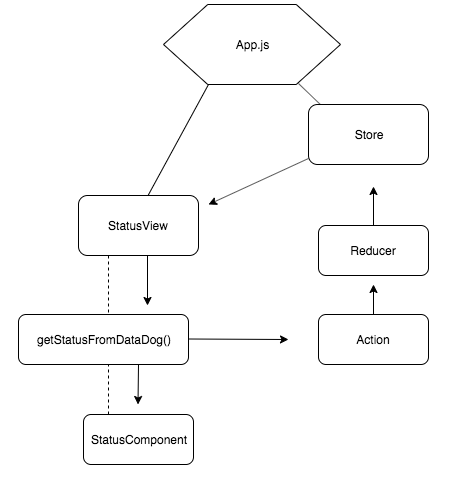

### Objective

Documentation for status-app
https://github.com/mikaelahallenberg/status-app/
Hosted at 
https://mikaelahallenberg.github.io/status-app/

The objective was to create a service that gets the updated statuses initially from two service providers in 10-minute intervals and displays fetched status resources on the page. The preferred tool was React+Redux with a focus on usability and maintainability. 
No more than 10 hours maximum would be used for each step in total.
The final implementation is hosted on GitHub pages.

Planned time allocation 
(hours)

1 Study API documentation
1 Plan architecture
5.5 Development of project including relevant studies
0.5 Setup GitHub page
2 Documentation write up

=10 Total 

### Implementation

Breakdown of relevant files: 

App.js
	The starting point which collects child components and acts as initializing file. 
    Redux store is created and middleware for asynchronous calls are configured

status-action.js
    Creates and handles actions dispatched to the reducer. Creates functionality for fetching data in 10-minute intervals

status-reducer.js 
	Gets data and maps it to relevant variables and returns it while maintaining immutability principles

status.service.js
	Gets data through fetch() and maps it to suit the predetermined format. Parsing of data is handled individually according to API responses formats

status-view.js
	Receives data through props and sends it down to the component

status-component.js
	Displays data and styles it

error.js
	Displays error message and acts as ErrorBoundary

path-service.js
	Gets the URL for the fetch() function which matches with the parameter it’s being called with

status-paths.json
	Mock data file used with paths and tests to avoid making calls to API endpoints

Description:
In this implementation, only one endpoint is used as an example to demonstrate functionality and application architecture.

This application was created using `create-react-app` as a base, however, some basic features were deemed unnecessary and have been deleted.

Fetching of data and response parsing is handled one by one, each API endpoint individually. 

This is due to individual limitations and restrictions for each API endpoint, so one function which collectively gets and parses the responses would not be suitable for this case. 
Promise.all() would also not be ideal since it would wait for all endpoints to get completed and parsed before any data would be visible on the View.
This makes adding endpoints a multiple-step process since a new function (named in a similar fashion to async getStatusFromAzure()) needs to be added with a fetch() call as well as appropriate parsing of response data.
This application is a potential use case for GraphQL here since it allows for requesting only specific data from the endpoint.
Response data is mapped to follow a specific format so it can be easily accessed in child components.

Ideally actions would be called with one set of data and asynchronous functions would be kept to a minimum to avoid response time discrepancies. 

## Limitations

Originally the objective was to get data from following endpoints 

https://status.azure.com/en-gb/status 
and 
https://status.datadoghq.com/

DataDog status API documentation was found from the network tab after observing the network calls. 
The Azure endpoint could not be found after trying the following resources:

https://docs.microsoft.com/en-us/rest/api/resourcehealth/availabilitystatuses
https://docs.microsoft.com/en-us/rest/api/resourcehealth/operations/list
https://docs.microsoft.com/en-us/azure/azure-monitor/platform/rest-api-walkthrough
https://github.com/Azure/azure-sdk-for-js/blob/master/sdk/resourcehealth/arm-resourcehealth/src/microsoftResourceHealth.ts
https://azure.github.io/azure-sdk-for-js/arm-resourcehealth/index.html

Due to inability of find the correct endpoint and the fact that a lot of time was spent on trying to figure out how this particular API works, it was decided to instead produce some example code and leave this research for later as t was deemed more important to stick with time allocations.

## Future development

More sophisticated tests need to be conducted to see whether the functions return data in correct format or if any data is returned at all, (no actual API calls need to be made) as well as functionality for getting statuses from API endpoints which require authentication. 
Keys and tokens should be secured and stored securely and according to best practices.

Fetching of data might need future development efforts. Asynchronous calls expose potential bugs where data is not sent correctly onwards to the reducers and down to the components.
Tests would potentially be able to catch these vulnerabilities in the code. 
It would be worthy to use timeout-promise.js in getDataInIntervals(600000), where data is re-fetched and passed on to reducer. This would clean up the code and make it more readable as well as wrap the entire call in the timeout wrapper function.
 
